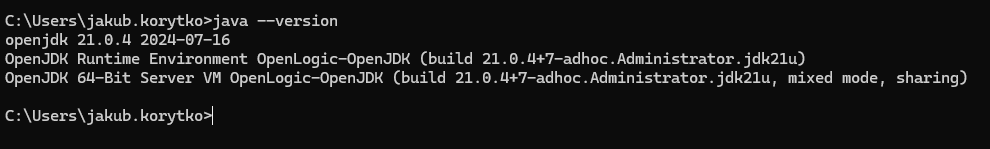
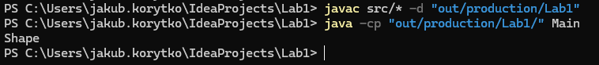

# Laboratorium 1

## Zadanie 1

## Zadanie 2

[Commit
3efb1cc](https://github.com/JakubKorytko/pwjj-pk/tree/3efb1cc32a498bdb97c89a3a129ad0a40ef844a4)
oraz zrzut ekranu\

## Zadanie 3

Obecny stan repozytorium