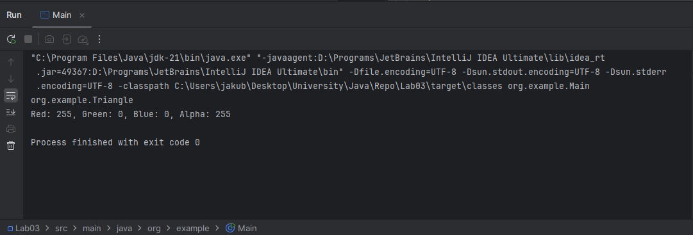
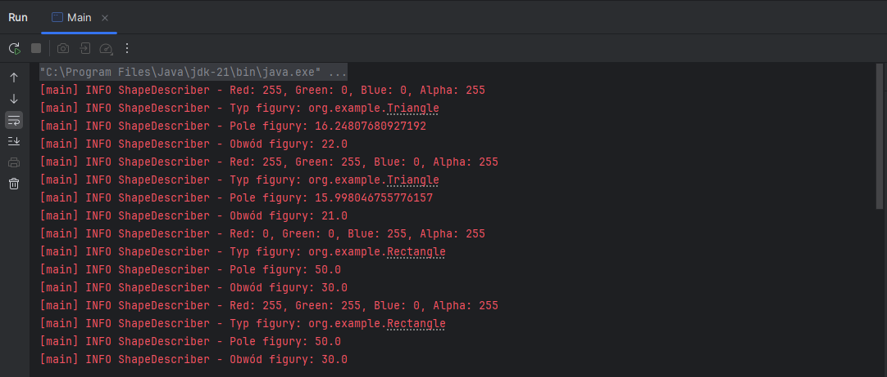
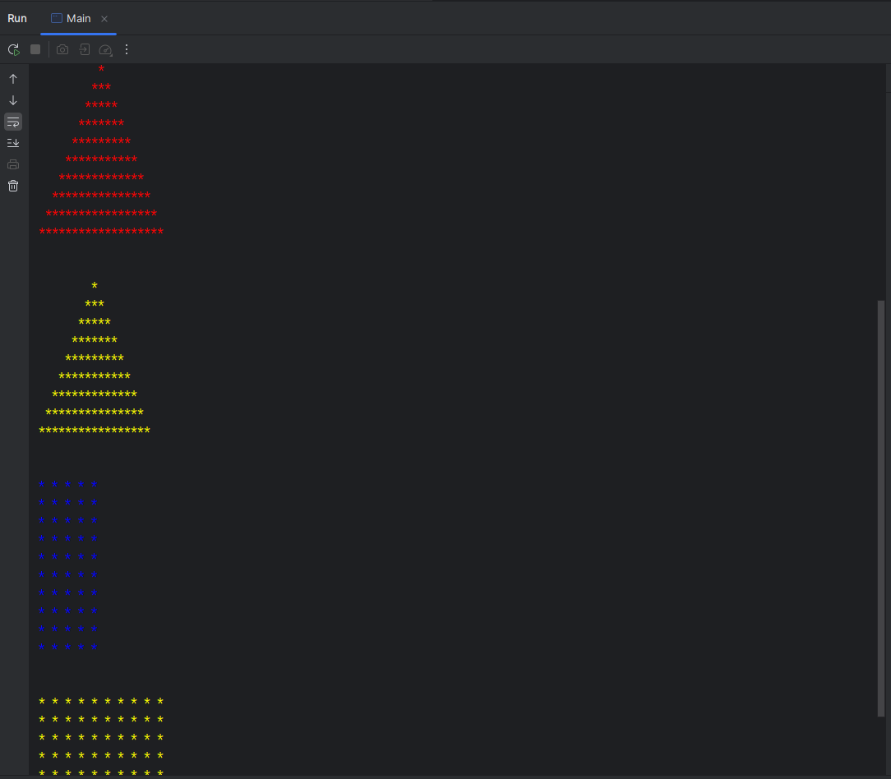
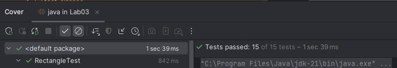
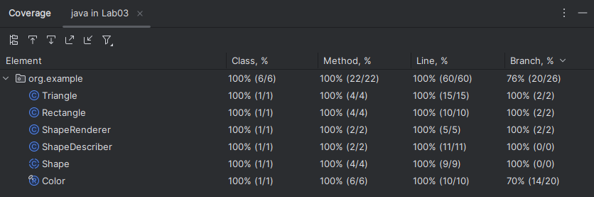

# Laboratorium 3

## Zadanie 1

[Folder Lab03 w commicie efc6975](https://github.com/JakubKorytko/pwjj-pk/tree/efc6975f372b1efc29e02d6bb89ee6564de6b86f/Lab03)

## Zadanie 2

[Folder Lab03 w commicie ba9135b](https://github.com/JakubKorytko/pwjj-pk/tree/ba9135bd7242840c0d659448fda1f13378047374/Lab03)
oraz zrzut ekranu\

## Zadanie 3

[Folder Lab03 w commicie 6d46ded](https://github.com/JakubKorytko/pwjj-pk/tree/6d46ded649e904e21b2bc215de53448060094aee/Lab03)
oraz zrzut ekranu\

## Zadanie 4

[Folder Lab03 w commicie dd1f468](https://github.com/JakubKorytko/pwjj-pk/tree/dd1f468eae958a19a310e03894d529c5ccd31830/Lab03)
oraz zrzut ekranu\

## Zadanie 5

Obecny stan repozytorium oraz zrzuty ekranu\
\

