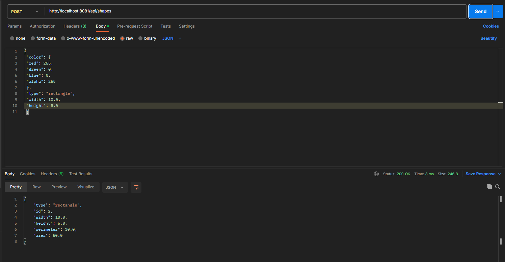
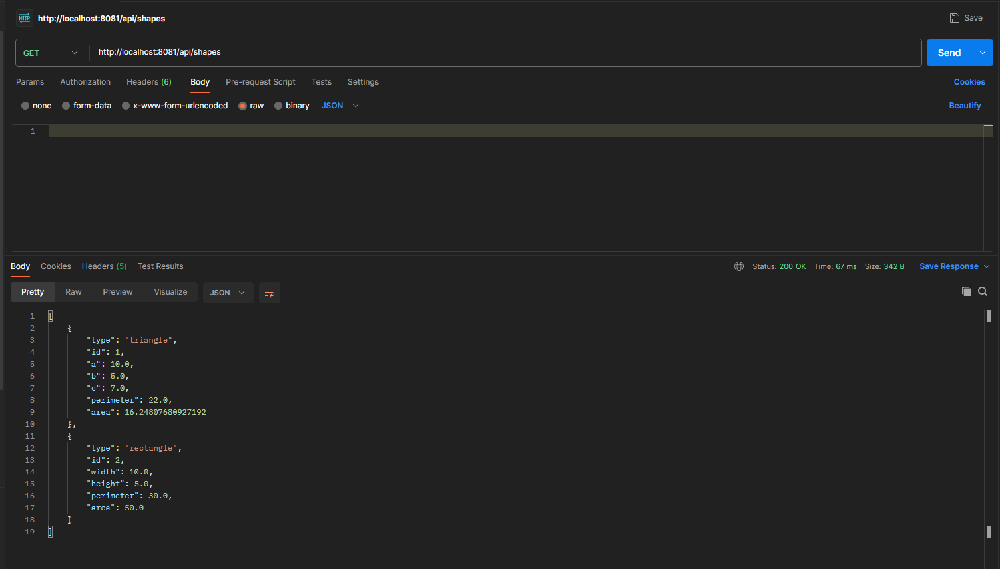

# Laboratorium 5

Całość zadania opiera sie na bazie PostgreSQL zainstalowanej lokalnie.\
Aby uruchomić zarówno aplikacje jak i testy bazy należy edytować plik [hibernate.cfg.xml](./src/main/resources/hibernate.cfg.xml)
i uzupełnić go stosownymi danymi.\
Hasło do bazy danych należy ustawić w zmiennej środowiskowej `DB_PASSWORD` zarówno przy uruchamianiu testów jak i aplikacji.

Zrzuty ekranu działania z poziomu Postmana:

\
\
